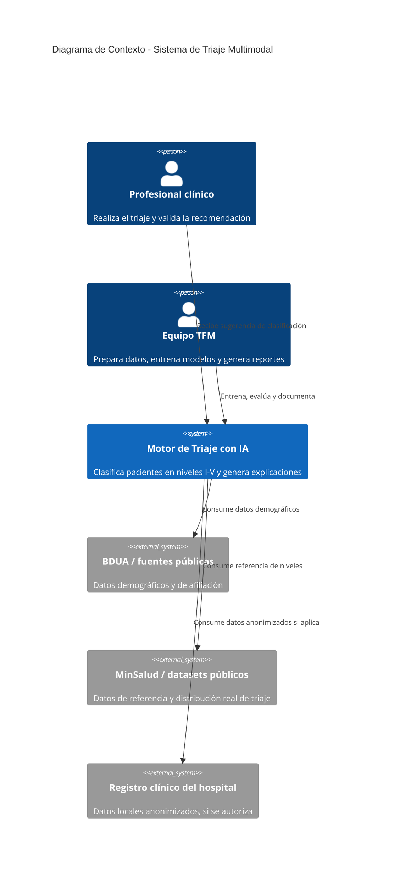
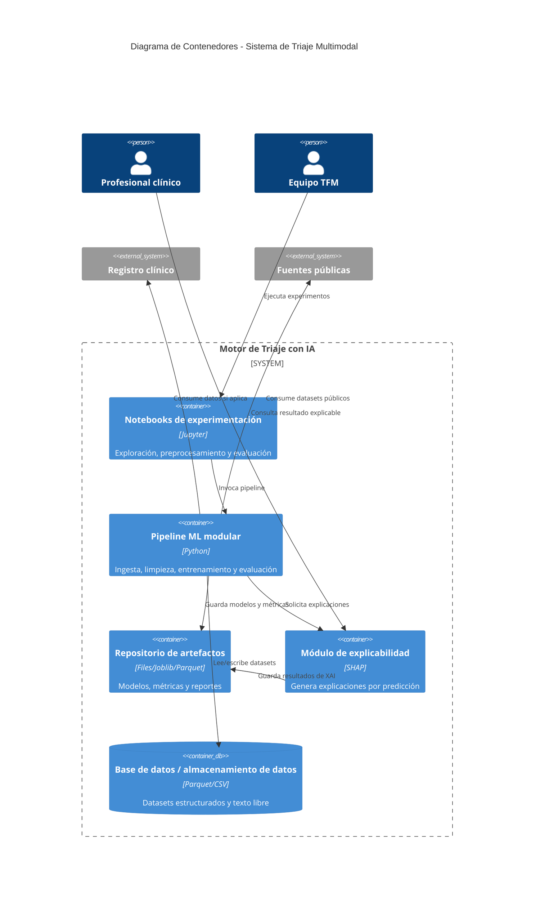
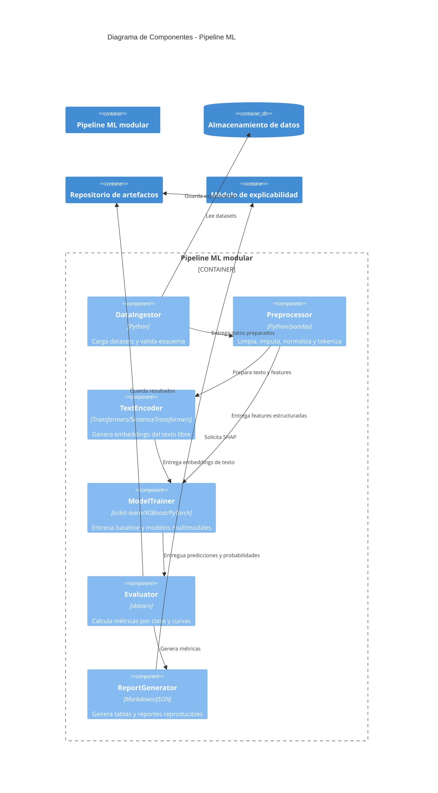
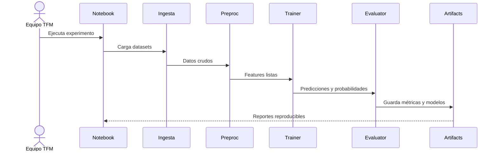
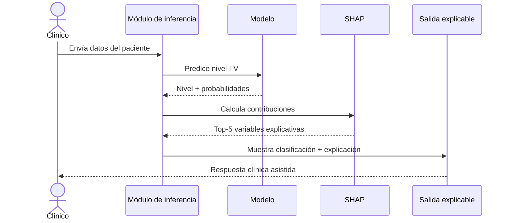
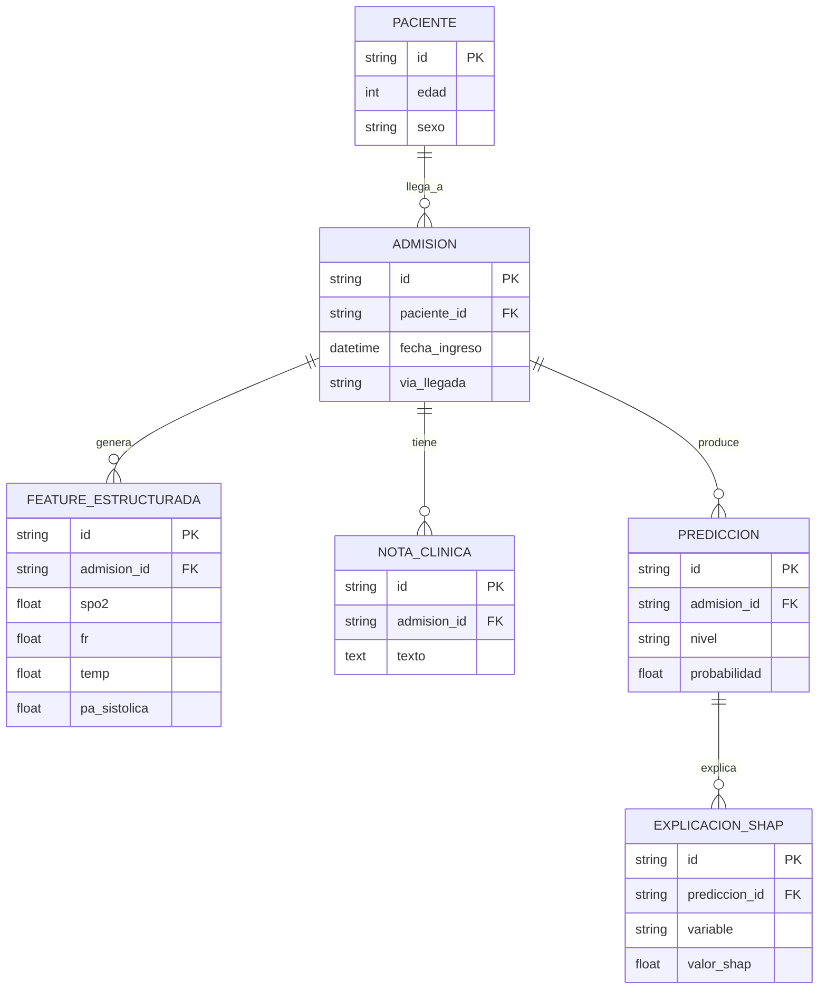

# Documento de Arquitectura de Software: Sistema de Triaje Multimodal basado en IA

**Versión:** 0.1  
**Fecha:** 2026-07-14  
**Tipo de documento:** Arquitectura propuesta / MVP offline  
**Autor:** Asistencia de IA, orientada al TFM de triaje clínico

## 1. Introducción y objetivos

### 1.1 Propósito del sistema
El sistema propuesto es un motor de apoyo a la decisión clínica para clasificar pacientes de urgencias en los 5 niveles de la Resolución 5596 de 2015, usando datos estructurados y texto libre de admisión. No reemplaza el criterio médico; su propósito es reducir la variabilidad del triaje y mejorar la detección temprana de casos críticos.

### 1.2 Requerimientos funcionales clave
- Clasificar pacientes en niveles I–V con salida ordinal y probabilística.
- Integrar features estructuradas y texto libre de notas clínicas.
- Producir explicaciones clínicas por predicción mediante SHAP.
- Soportar experimentación comparativa entre modelos baseline y enfoques multimodales.
- Generar artefactos reproducibles (notebooks, scripts, métricas y modelos serializados).

### 1.3 Atributos de calidad
| Atributo | Prioridad | Objetivo concreto |
|---|---|---|
| Precisión clínica | Alta | F1 macro ≥ 0.82, Recall macro ≥ 0.80 |
| Sensibilidad en niveles críticos | Alta | Recall Nivel I ≥ 0.90, Nivel II ≥ 0.85 |
| Explicabilidad | Alta | Mostrar top-5 variables SHAP por predicción en lenguaje comprensible |
| Reproducibilidad | Alta | Ejecutar el flujo completo con el mismo entorno y seeds |
| Privacidad y trazabilidad | Alta | Anonimización obligatoria y registro de predicciones |
| Mantenibilidad | Media | Separar ingest, preprocesamiento, entrenamiento, evaluación y XAI |

### 1.4 Interesados
- Equipo TFM y autores del trabajo.
- Directora del proyecto, Damaris Fuentes Lorenzo.
- Comité de Ética del Hospital San Juan de Dios.
- Profesionales clínicos que validarán la utilidad del sistema.

## 2. Restricciones
- El sistema es offline y de apoyo; no se contempla integración en tiempo real con un EHR o HCE.
- El uso de datos locales del hospital depende de autorización ética.
- Se debe cumplir Ley 1581 de 2012 y anonimización previa.
- El proyecto está limitado por recursos de cómputo y por la disponibilidad de datos locales.
- Los umbrales operativos para alertas I–II deben validarse con el criterio clínico del hospital.

## 3. Alcance y contexto del sistema

### 3.1 Contexto de negocio
El sistema opera en el punto de admisión de urgencias. Recibe datos del paciente, los procesa con un modelo multimodal y devuelve una clasificación y una explicación que apoya la toma de decisión humana. El valor de negocio no está en reemplazar al clínico, sino en priorizar casos críticos y reducir sesgos subjetivos.

### 3.2 Diagrama de Contexto (C4 Nivel 1)

## 4. Estrategia de solución
La arquitectura propuesta sigue un patrón modular y reproducible para experimentación offline. Se separan claramente las capas de ingestión, preprocesamiento, entrenamiento, evaluación, explicabilidad y generación de reportes. La decisión principal es usar un pipeline multimodal que combine datos estructurados y texto libre, comparando fusión temprana y tardía antes de escoger el enfoque final.

### 4.1 Calidad de datos
- Completar y estandarizar variables críticas: oxigenación, respiración, temperatura, presión arterial, edad, vía de llegada.
- Documentar nulos, outliers y rangos clínicamente válidos.
- Aplicar anonimización estricta antes de cualquier procesamiento.
- Evaluar sesgo geográfico y representatividad de los datasets usados.

### 4.2 Estrategia experimental
- Entrenamiento con splits train/validation/test.
- Validación con 10-fold cross-validation para modelos base y multimodales.
- Métricas por clase y comparación con benchmarks clínicos.
- Uso de técnicas de manejo de desbalance: class weights, SMOTE y focal loss según el caso.

## 5. Vista de Contenedores (C4 Nivel 2)

## 6. Vista de Componentes (C4 Nivel 3)

## 7. Vistas de ejecución: diagramas de secuencia

### 7.1 Flujo de entrenamiento y evaluación

### 7.2 Flujo de inferencia con explicabilidad

## 8. Modelo de datos

## 9. Conceptos transversales
- Autenticación y autorización: no aplica a nivel de MVP, pero sí se recomienda registrar el acceso a datasets y artefactos.
- Manejo de errores y resiliencia: validaciones estrictas de esquema, reintentos para ingestión y rollback de artefactos fallidos.
- Logging y observabilidad: registro de métricas, seeds, versiones de datasets y resultados experimentales.
- Gestión de configuración y secretos: variables de entorno para credenciales y rutas de datos.
- Privacidad y trazabilidad: logs de auditoría para cada predicción y anonimización previa.

## 10. Decisiones arquitectónicas (ADRs)

### ADR-001: Usar un pipeline modular de Python para entrenar baseline y multimodal
- **Contexto:** El proyecto requiere reproducibilidad y comparación de enfoques, no solo un modelo único.
- **Decisión:** Separar ingestión, preprocesamiento, entrenamiento, evaluación y XAI en módulos independientes.
- **Alternativas consideradas:** notebook monolítico, pipeline con Airflow, pipeline orientado a servicios.
- **Consecuencias:** Mayor mantenibilidad, pero más esfuerzo inicial para estructurar el código.

### ADR-002: Priorizar SHAP como mecanismo de explicabilidad
- **Contexto:** La adopción clínica requiere explicaciones comprensibles y auditables.
- **Decisión:** Generar explicaciones SHAP por predicción y registrarlas como artefactos reproducibles.
- **Alternativas consideradas:** LIME, reglas de negocio, explicaciones internas de árbol.
- **Consecuencias:** Mejor transparencia clínica, pero mayor costo computacional para algunas instancias.

## 11. Vista de Despliegue
El despliegue de este MVP se modela como un entorno de experimentación y reproducibilidad, con notebooks locales o en entorno cloud ligero y almacenamiento compartido para artefactos. Los archivos de diagrama asociados se encuentran en la carpeta de arquitectura.

- Diagrama de despliegue: [Despliegue_Triage_Multimodal_IA.drawio](Despliegue_Triage_Multimodal_IA.drawio)
- Diagrama de flujo de experimentación: [Flujo_Experimentacion_Triage_Multimodal_IA.drawio](Flujo_Experimentacion_Triage_Multimodal_IA.drawio)

## 12. Riesgos y deuda técnica
- Acceso a datos del hospital podría quedar bloqueado por autorización ética.
- El desbalance de clases puede degradar el recall de los niveles I–II.
- La calidad de las notas clínicas puede afectar el rendimiento del submodelo textual.
- Si no se define pronto el enfoque de fusión final, se perderá tiempo en experimentos redundantes.

## 13. Supuestos
- Se asume que el equipo entregará los datasets en formato CSV/Parquet y podrá acceder a datasets públicos.
- Se asume que el entorno de ejecución será Python 3.10/3.11 con CPU o GPU limitada.
- Se asume que no habrá integración en producción ni interfaz clínica en este MVP.
- Se asume que los umbrales clínicos serán validados por la directora y el equipo clínico antes de una implementación posterior.

## 14. Glosario
- Early fusion: concatenación de features estructuradas y embeddings de texto antes del clasificador.
- Late fusion: combinación de decisiones o probabilidades de submodelos independientes.
- SHAP: técnica de explicabilidad basada en contribuciones de features.
- MVP: mínima versión viable para experimentación y documentación académica.
